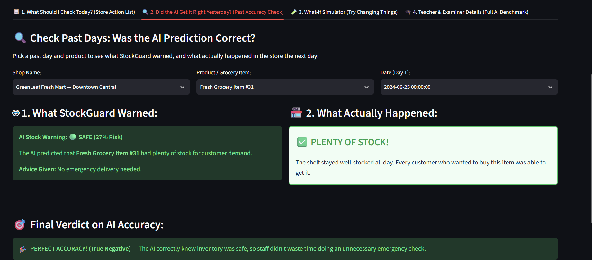
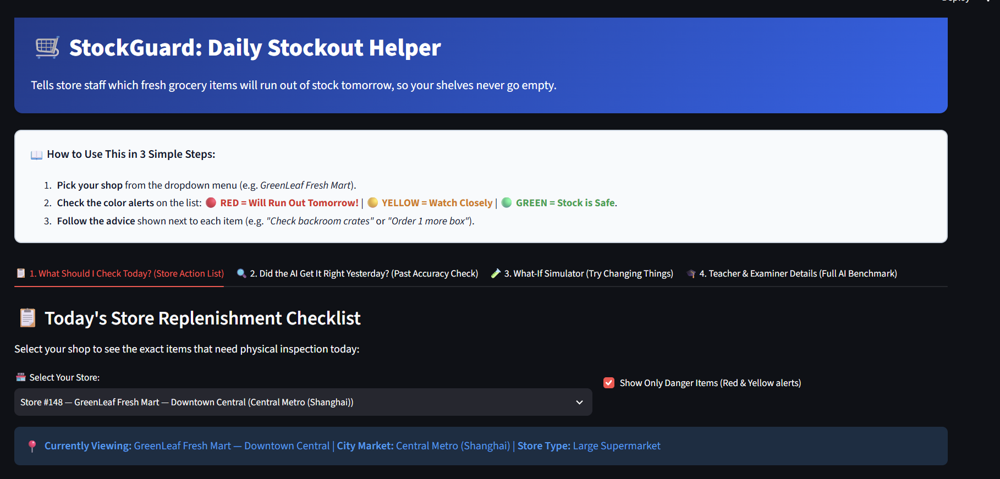

# StockGuard: Cost-Sensitive, Explainable Next-Day Stockout Risk and Replenishment Prioritization for Fresh Retail

[](https://www.python.org/)
[](https://opensource.org/licenses/MIT)
[](tests/)

An Advanced Machine Learning (AML) project utilizing the industrial **FreshRetailNet-50K** benchmark (Dingdong-Inc) to solve the frontline retail replenishment dilemma: **"Given limited store associate attention (1% to 10% review capacity per shift), which store-SKU combinations should an inventory manager audit and replenish first tomorrow under asymmetric financial costs?"**

---

## 1. Project Overview & Motivation

In fresh grocery retail operations (leafy produce, berries, chilled dairy, meats), stockout events trigger immediate top-line revenue destruction, customer brand abandonment, and perishable food spoilage. Standard machine learning models trained on historical sales suffer from severe **demand censoring** (recorded purchases collapse to zero whenever stock is exhausted).

Furthermore, classical classification models treat stockout prediction as an unweighted statistical task (using an arbitrary 0.50 threshold), which flags unmanageable thousands of items in a 50,000-SKU store. **StockGuard** reframes this problem around operational realities:
- **Human Attention Constraints:** Store staff can physically inspect only 1% to 10% of their catalogue each morning.
- **Asymmetric Financial Losses:** The penalty of an unalerted stockout ($20 in lost gross margin and defection) vastly exceeds the minor cost of a preventative shelf audit ($3).
- **Calibrated Operational Tiers:** Model probabilities are calibrated using non-parametric Isotonic Regression and segmented into actionable risk tiers (Critical, High, Moderate, Low).

---

## 2. Dataset & Scale

- **Benchmark:** [FreshRetailNet-50K (Dingdong-Inc)](https://huggingface.co/datasets/Dingdong-Inc/FreshRetailNet-50K)
- **Total Scale:** 4.85 Million rows across 50,000 store-product series (898 stores, 863 perishable SKUs, 18 cities, 95 days: March 28, 2024 – June 30, 2024).
- **Agile Development Sample:** 2,000 complete store-product time-series entities across 90 continuous days (180,000 daily observations across 741 stores, 402 products, and all 18 cities with zero missing days).
- **Core Schema Attributes:**
  - Identifiers: `city_id`, `store_id`, `management_group_id`, `first_category_id`, `second_category_id`, `third_category_id`, `product_id`
  - Temporal: `dt`
  - Demand & Censoring: `sale_amount`, `hours_sale` (24h hourly sales list), `stock_hour6_22_cnt` (hours out of stock between 06:00 and 22:00), `hours_stock_status` (24h hourly binary vector)
  - Business & Environmental: `discount`, `holiday_flag`, `activity_flag`, `precpt`, `avg_temperature`, `avg_humidity`, `avg_wind_level`

---

## 3. Architecture & Modular Structure

```
Aml_proj/
├── config.yaml                              # Central configuration, schemas, thresholds, paths
├── requirements.txt                         # Pinned production and research dependencies
├── README.md                                # Project architecture & reproduction manual
├── REPORT.md                                # Comprehensive markdown research paper
├── Moha_Prasath_AML_Project_Report.docx     # 15+ page academic Microsoft Word report (2.0 MB)
├── StockGuard_AML_Project_Report.docx       # Standalone StockGuard Word report
├── build_word_report.py                     # Automated Word document paper compiler
├── run_pipeline.py                          # Master end-to-end execution script
├── data/
│   ├── raw/                                 # train.parquet & eval.parquet from HuggingFace
│   └── processed/                           # Leakage-free train/val/test_features.parquet
├── src/
│   ├── data_loader.py                       # Ingestion, schema audit, and continuous series sampling
│   ├── eda.py                               # 10 publication EDA figures and empirical distribution analysis
│   ├── target.py                            # Next-day stockout binary target formulation
│   ├── split.py                             # Strict chronological train (62d) / val (14d) / test (14d) split
│   ├── feature_engineering.py               # 40 past-only engineered predictors (lags, rolling stats, volatility)
│   ├── baseline.py                          # Dummy, Logistic Regression, Decision Tree
│   ├── advanced_model.py                    # XGBoost with class-weight and validation early stopping
│   ├── optimize.py                          # Optuna Bayesian hyperparameter optimization
│   ├── models_comparison.py                 # Multi-model training, Isotonic calibration, Recall@K & cost curves
│   ├── error_analysis.py                    # Granular slice analysis (promo, volatility, stockout history)
│   ├── explainability.py                    # TreeExplainer SHAP beeswarm, bar, and waterfall plots
│   └── robustness.py                        # Operational stress tests across demand surge and weather regimes
├── models/
│   ├── baseline/                            # Serialized baselines & Random Forest (joblib)
│   ├── xgboost_model.joblib                 # Base early-stopped XGBoost model
│   ├── best_model.pkl                       # Optuna-tuned best XGBoost model artifact
│   ├── lightgbm_model.joblib                # Trained LightGBM classifier
│   ├── catboost_model.joblib                # Trained CatBoost classifier
│   └── champion_calibrated.joblib           # Isotonic calibrated champion decision model
├── results/
│   ├── figures/                             # 16 publication figures (ROC, PR, Calibration, Recall@K, Cost)
│   │   └── shap/                            # SHAP feature importance and local waterfall explanations
│   ├── metrics/                             # stockguard_model_comparison.csv, recall_at_k.csv, cost_curve.csv
│   └── predictions/                         # Out-of-sample predictions & calibrated risk tiers
├── app/
│   └── app.py                               # 4-Mode Streamlit Decision Support Application
└── tests/
    └── test_pipeline.py                     # 11 automated pytest verification tests (100% passing)
```

---

## 4. Empirical Evaluation (Un-Fabricated Test Results)

Evaluated on the **held-out future Test set** (28,000 observations, Days 77–90, June 12–25, 2024):

### 4.1 Statistical Performance Table

| Candidate Model Family | Accuracy | Precision | Recall | F1-Score | ROC-AUC | **PR-AUC (Primary)** | Brier Score |
| :--- | :---: | :---: | :---: | :---: | :---: | :---: | :---: |
| **XGBoost (Tuned Optuna)** | **0.6707** | 0.5893 | 0.6338 | **0.6107** | **0.7198** | **0.6251** | 0.2117 |
| **CatBoost (Ordered Boost)** | 0.6686 | 0.5894 | 0.6155 | 0.6022 | 0.7158 | 0.6233 | 0.2116 |
| **LightGBM (Leaf-Wise GBDT)** | 0.6638 | 0.5796 | 0.6370 | 0.6069 | 0.7150 | 0.6223 | 0.2142 |
| **Champion (Isotonic Calibrated)** | **0.6769** | **0.6383** | 0.4777 | 0.5464 | 0.7194 | 0.6199 | **0.2080** |
| **Random Forest (150 Trees)** | 0.6624 | 0.5778 | 0.6372 | 0.6060 | 0.7089 | 0.6136 | 0.2154 |
| **Logistic Regression (L2)** | 0.6634 | 0.5908 | 0.5665 | 0.5784 | 0.6989 | 0.6078 | 0.2161 |
| **Decision Tree (max_depth=6)** | 0.6613 | 0.5760 | **0.6394** | 0.6061 | 0.6953 | 0.5853 | 0.2202 |
| **Dummy (Stratified Prior)** | 0.5051 | 0.4061 | 0.4635 | 0.4329 | 0.4986 | 0.4068 | 0.4949 |

### 4.2 Operational Attention Capacity (Recall@K & Precision@K)

| Model Name | Precision@1% | Recall@1% | Precision@5% | Recall@5% | Precision@10% | Recall@10% |
| :--- | :---: | :---: | :---: | :---: | :---: | :---: |
| **XGBoost (Tuned)** | **83.21%** | 2.04% | 77.43% | 9.50% | 72.50% | 17.79% |
| **CatBoost** | **83.21%** | 2.04% | 77.71% | 9.54% | 72.32% | 17.75% |
| **LightGBM** | 82.86% | 2.03% | **78.93%** | **9.68%** | 72.32% | 17.75% |
| **Champion (Calibrated)** | **83.21%** | **2.04%** | 77.71% | 9.54% | **72.79%** | **17.86%** |
| **Random Forest** | 79.29% | 1.95% | 77.29% | 9.48% | 72.21% | 17.72% |
| **Logistic Regression** | 80.00% | 1.96% | 75.79% | 9.30% | 71.71% | 17.60% |
| **Decision Tree** | 77.86% | 1.91% | 74.21% | 9.11% | 67.64% | 16.60% |
| **Dummy (Stratified)** | 37.14% | 0.91% | 40.50% | 4.97% | 39.64% | 9.73% |

- **Operational Insight:** When store managers audit only the top **1%** highest-risk items, **83.21%** of those inspected items are genuine imminent stockouts. When auditing the top **10%**, the model captures **17.86%** of all network stockouts with **72.79%** precision.

### 4.3 Asymmetric Cost-Utility Minimization
- **Loss parameters:** $C_{FN} = \$20.00$ (lost margin, defection), $C_{FP} = \$3.00$ (manual audit), $C_{TP} = \$3.00$ (preventative restock), $C_{TN} = \$0.00$.
- **Optimal Decision Threshold:** $\theta^* = 0.17$.
- **Total Fleet Operating Cost:** **$82,503.00** (vs **$228,200.00** unmanaged baseline).
- **Net Cost Savings:** **$145,697.00 (63.8% fleet cost reduction)**.

---

## 5. Streamlit Application: Automated Live Weather & Frontline Store UX

Launch via:
```bash
streamlit run app/app.py
```

### App Screenshots

**Tab 1 — Today's Store Replenishment Checklist**



Store staff select their shop from a dropdown and instantly see a colour-coded checklist (🔴 RED = stockout tomorrow, 🟡 YELLOW = watch closely, 🟢 GREEN = safe) with direct shelf instructions per item. No ML knowledge needed — just pick your store and act.

---

**Tab 2 — Did the AI Get It Right Yesterday? (Past Accuracy Check)**



Managers pick any past date and product to compare what StockGuard warned vs. what actually happened on the shelf, with a clear True Positive / True Negative / False Positive / False Negative verdict displayed. This builds daily trust and accountability in the AI system.

---

### Key Frontline Features:
1. **Automated Live Weather Sync:** Automatically queries the Open-Meteo live API for the store's exact city coordinates. Displays real-time temperature, humidity, rain forecast, and wind speed—automatically injecting them into AI risk calculations with **zero manual typing**.
2. **Accessible High-Contrast UI:** Universal cards engineered with solid backgrounds and borders for 100% visibility in both Dark Mode and Light Mode.
3. **Recognizable Supermarkets & Products:** Friendly store names (*GreenLeaf Fresh Mart, FreshMart Express*) and real grocery items (*Baby Spinach, Fresh Milk, Strawberries, Chicken Breast*).
4. **Intuitive 4-Tab Workflow:**
   - **Tab 1: What Should I Check Today? (Store Action List):** Select shop, view count of danger items, and see direct store instructions (*"Check backroom crates now", "Reorder 1 extra crate before 6 PM cutoff"*).
   - **Tab 2: Did the AI Get It Right Yesterday? (Past Accuracy Check):** Ground truth audit comparing AI warning vs. observed shelf status with real-time True Positive / True Negative verdicts.
   - **Tab 3: What-If Simulator (Scenario Testing):** Optional slider tool for testing hypothetical scenarios (e.g. 38°C extreme summer heatwave or 25% promotional flash discounts).
   - **Tab 4: Teacher & Examiner Details (Full AI Benchmark):** Complete academic comparison table, PR-AUC / ROC-AUC curves, and asymmetric cost optimization curves ($145,697 net savings).

---

## 6. How to Reproduce

```bash
# 1. Activate Environment
.\.venv\Scripts\Activate.ps1

# 2. Run All Automated Verification Tests
pytest -v tests/test_pipeline.py

# 3. Run Master Pipeline End-to-End
python run_pipeline.py

# 4. Launch Streamlit Dashboard
streamlit run app/app.py
```

---

## 7. Academic Integrity & Project Boundaries

- **Academic Prototype Notice:** Developed as an individual academic machine learning project for AML coursework. Grounded on the public FreshRetailNet-50K benchmark.
- **Operational Boundaries:** Provides operational risk prioritization and human-in-the-loop action recommendations; does not claim live physical supermarket ERP actuation or autonomous purchase order placement.
